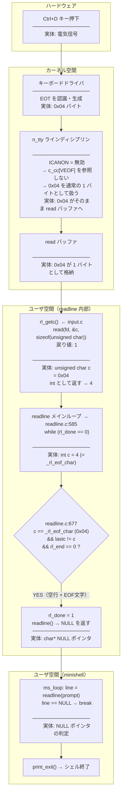
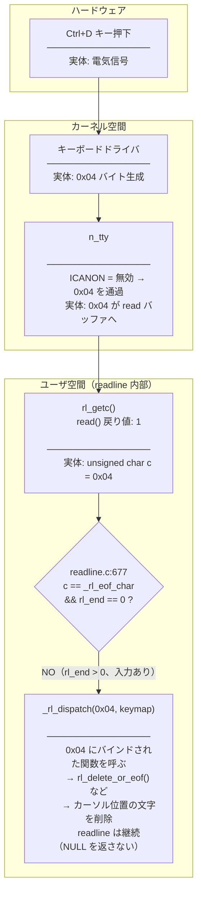
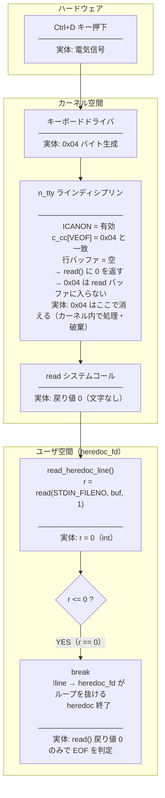
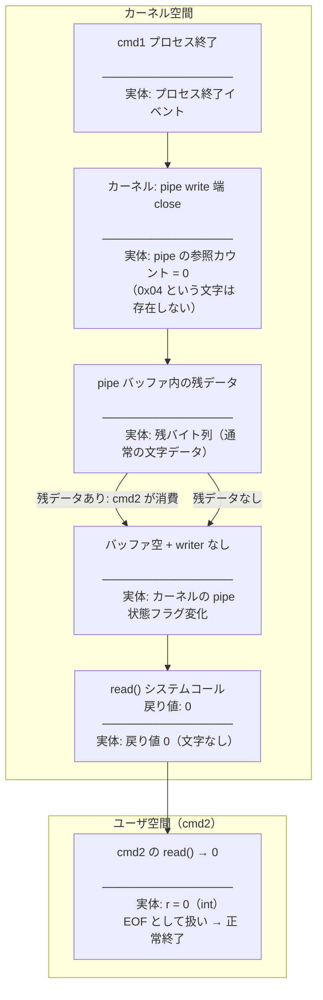

# minishell Ctrl+D 配送経路レポート

## 訂正: Ctrl+D の正体

tty において Ctrl+D は **EOT（End of Transmission、ASCII 0x04）** を端末ラインディシプリンへ送る操作。
「EOF フラグ」ではない。フェーズによって 0x04 という実体が届く場所・形・空間がまったく異なる。

---

## 前提: readline が端末モードを変える

readline は呼び出し中と return 後で端末設定を切り替える。
これが Ctrl+D の経路を決定的に変える。

```
readline() 呼び出し
    └─ rl_prep_terminal()   ← ICANON を無効化
                              c_cc[VEOF](=0x04) を _rl_eof_char に保存

readline() return
    └─ rl_deprep_terminal() ← ICANON を元に戻す（canonical 復元）
```

---

## フロー図 A: readline 待機中・空行で Ctrl+D

> 端末は **non-canonical モード**（readline が ICANON を無効化中）



---

## フロー図 B: readline 待機中・入力途中で Ctrl+D

> 同じく **non-canonical モード**。ただし行バッファが空でない場合



**ポイント**: 入力途中の Ctrl+D は EOF ではなく文字削除。
0x04 はユーザ空間に `unsigned char` として届くが、EOF ではなくキーバインドとして処理される。

---

## フロー図 C: heredoc read() 待機中・空行で Ctrl+D

> readline が return した後、端末は **canonical モードに復元**されている。
> claude の heredoc は `read(STDIN_FILENO, buf, 1)` を直接呼ぶ。



**ポイント**: 0x04 はカーネル空間で消費され、**ユーザ空間には届かない**。
`read()` の戻り値 `0` だけが EOF の根拠となる。

---

## フロー図 D: heredoc read() 待機中・入力途中で Ctrl+D

> **canonical モード**、行バッファに "hel" がある状態

```mermaid
flowchart TD
    subgraph HW["ハードウェア"]
        KB["Ctrl+D キー押下（1回目）
        ────────────────
        実体: 電気信号"]
    end

    subgraph KS["カーネル空間"]
        KBDRV["キーボードドライバ
        ────────────────
        実体: 0x04 バイト生成"]

        NTTY["n_tty
        ────────────────
        ICANON = 有効
        c_cc[VEOF] = 0x04 と一致
        行バッファ = 'h','e','l'（非空）
        → バッファを即時フラッシュ
        → '\\n' も 0x04 も追加しない
        → 0x04 は破棄
        実体: 'h','e','l' が read バッファへ（0x04 なし）"]

        RBUF["read バッファ
        ────────────────
        実体: 'h'(0x68), 'e'(0x65), 'l'(0x6C) の 3 バイト"]
    end

    subgraph US1["ユーザ空間（1回目 Ctrl+D 後）"]
        R1["read() → 'h'（1バイト）"]
        R2["read() → 'e'（1バイト）"]
        R3["read() → 'l'（1バイト）"]
        BLOCK["read() → ブロック
        ────────────────
        バッファが空になり次の入力を待つ
        実体: システムコールがブロック中"]
    end

    subgraph HW2["2回目 Ctrl+D"]
        KB2["Ctrl+D キー押下（2回目）
        ────────────────
        行バッファ = 空
        → read() に 0 を返す"]
    end

    subgraph US2["ユーザ空間（2回目 Ctrl+D 後）"]
        R4["read() → 0
        ────────────────
        実体: r = 0（int）"]

        PARTIAL["read_heredoc_line():
        'h','e','l' が line に蓄積済み
        r <= 0 → break
        r <= 0 && !*line → false
        ────────────────
        実体: 'hel'（改行なし）を返す"]

        WRITE["heredoc_fd:
        'hel'（改行なし）をパイプへ書き込む
        ────────────────
        bash との差異: bash は改行を補完する"]

        NULL2["次の read_heredoc_line():
        read() = 0 → NULL → heredoc 終了"]
    end

    KB --> KBDRV --> NTTY --> RBUF --> R1 --> R2 --> R3 --> BLOCK
    BLOCK --> KB2 --> R4 --> PARTIAL --> WRITE --> NULL2
```



---

## フロー図 E: パイプライン EOF 伝播（キーボード無関係）



---

## 各フェーズでの Ctrl+D の実体 まとめ

| フェーズ | 端末モード | カーネル空間での実体 | ユーザ空間での実体 |
|---|---|---|---|
| readline 中（空行） | non-canonical | 0x04 バイトが read バッファに格納 | `unsigned char c = 0x04`、readline が NULL 返却 |
| readline 中（入力途中） | non-canonical | 0x04 バイトが read バッファに格納 | `unsigned char c = 0x04`、キーバインドで文字削除 |
| heredoc read()（空行） | canonical | VEOF 処理で破棄、read() 戻り値 0 | `int r = 0` のみ、0x04 は届かない |
| heredoc read()（入力途中） | canonical | バッファフラッシュ後に 0x04 破棄、文字だけ渡る | `int r = 0`（2回目）、文字は char として届く |
| パイプ EOF | 非 tty | pipe 参照カウント変化、0x04 は存在しない | `int r = 0` のみ |

---

## claude 実装の問題点

### 問題: `r <= 0` で EINTR と EOF を区別しない

```c
r = read(STDIN_FILENO, buf, 1);
if (r <= 0)   // r==0 (本当のEOF) と r==-1 (EINTR) を同一視
    break;
```

正確には:
```c
if (r == 0)                       // 真の EOF（Ctrl+D、パイプ終端）
    break;
if (r < 0 && errno == EINTR)      // シグナル割り込み → 再試行
    continue;
if (r < 0)                        // その他エラー
    break;
```
